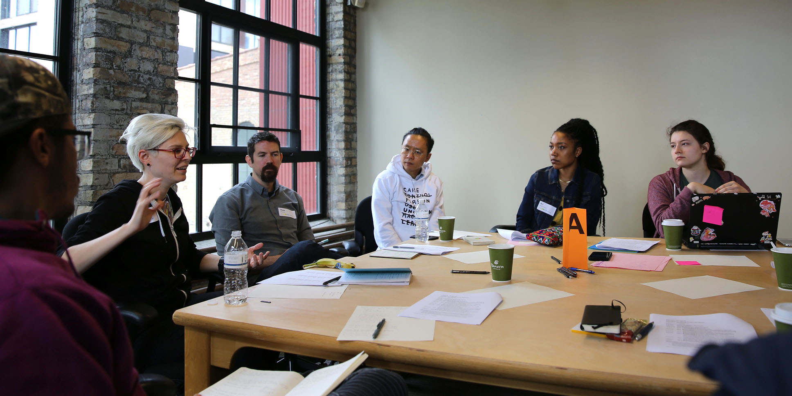

# 1. Challenges

[← Back to Contents](README.md)

###  What are the biggest challenges in OSSTA?

**Key themes that emerged included:**

* [Maintenance](#maintenance)
* [Funding](#funding)
* [Communication](#communication)
* [Community and Interaction](#community-and-interaction)
* [Access, Diversity, and Inclusion](#access-diversity-and-inclusion)
* [Documentation](#documentation)
* [Leadership Transition](#leadership-transition)

## Maintenance

Maintenance is necessary for the tools to remain compatible with new operating systems and platforms. Maintenance includes tasks such as updating the codebase to deal with updates to browsers, web specifications, operating systems, and hardware. It includes publishing new releases, editing and improving documentation and examples, updating the project website, guiding contributors, managing discussion on GitHub and other source-code repositories, and running social media accounts. Maintenance requires consistent effort and work which is often underrecognized compared to adding new features.

Participants at the convening reported a disconnect between the labor going into these projects and the user’s perception. As the tools improve in quality and professionalism, there is a tendency to see them as similar to commercial tools like Adobe Creative Suite, rather than tools made for artists by artists. The large amount of time and labor required to maintain and develop OSSTAs is often not directly visible to users. Many of the users do not know that people leading the project might be working in their free time without receiving remuneration. For long-term success of OSSTAs, maintenance and management structures, as well as the funding to support them, are needed. Maintenance is discussed further in [*Development and Maintenance: Management*](2_development_and_maintenance.md#management).

## Funding

Funding is one of the largest challenges many OSSTAs encounter. Many of these tools begin as a personal or small group project, but as they start to grow, funding is required for the continuation and maintenance of the tool. Small or small-scope OSSTAs can operate without funding if the creator remains committed, but as an OSSTA grows, it becomes unsustainable without funding. The challenge of sustainability is twofold. One, the internal infrastructure and leadership need to be supported to set up for long-term success instead of short-term gains. Two, funding sources have to be feasible and provide resources for longer periods of time. Funding is discussed further in [*Funding and Sustainability*](4_funding_and_sustainability.md).

## Communication

Communication is an area with many opportunities for improvement. Onboarding new members and making them feel welcome and respected is essential for the community. It is important to carefully consider the communication tools being used. There is also a need for an intentional and thoughtful approach to communication within these channels. One of the participants said, “How do you signal to people that they have a seat at the table, that the table is big and that there are seats available, and just how do we get that message out there?” Communication is discussed further in [*Development and Maintenance: Communication*](2_development_and_maintenance.md#communication).

## Community and Interaction

Participants emphasized the need to give attention to areas other than code. Creating a tool involves the management of contributors, volunteers, and other members of the community. Not every creator of a tool is interested in the creation of a community and the management of it, but this community seems to develop naturally as the number of people using the software grows. There is a need for the creation of guidelines for interaction and a code of conduct that guides best practices in which community members interact with each other. As people approach these tools from different backgrounds, it is also necessary to create paths to welcome newcomers into the space so that they feel accepted and invited. Community and interaction is discussed further in [*Community*](3_community.md).

## Access, Diversity, and Inclusion

Access was mentioned as a challenge by several members. The contributors and community members for this Convening are clustered geographically in New York City and Los Angeles. Moreover, the field is predominantly white and male, though this has been shifting in recent years, led by efforts from projects like p5.js who have centered values of diversity, inclusion, and access as core values for the community and tool. It is important to note that there are no official statistics about the demographic composition of the OSSTA community, but several participants voiced their concern about the aforementioned situations.
 
There is a need for contributors of more diverse backgrounds, identities, and skills. The overarching goal is to make the tools more culturally relevant for all people, particularly artists, no matter their coding or technical experience with the tools. One identified barrier is communicating to people outside the community the essential values of the open-source community. There is a desire to make the tools inclusive and accessible for a larger public, but given the centralized nature of the tools, creating pathways for newcomers to feel welcome and to start to participate in the community is a challenge. Access, diversity, and inclusion is discussed further in [*Community*](3_community.md).

## Documentation

Documentation is critical for OSSTAs to support users and continue to grow. As the tools become more elaborate and able to execute different tasks, the documentation of their functions is crucial. One participant said, “[A problem] no toolkit has solved well is developing a way in which documentation could be crowdsourced.” Another challenge arises in dealing with internationalization and supporting multiple languages in the documentation. Streamlining the contribution and documentation process is a goal that various participants voiced. Documentation is discussed further in [*Development and Maintenance: Documentation*](2_development_and_maintenance.md#documentation-and-education) and [*Community: Training and Mentorship for Users and Contributors*](3_community.md#training-and-mentorship-for-users-and-contributors).

## Leadership Transition

OSSTAs have various leadership models, but one common model adopted from open-source software outside of the arts is the “benevolent dictator.” This means that while the community may contribute and take on leadership roles, one or a few individuals have final say over all decisions. This model is considered to be both the reason for the initial success of many projects but also a barrier to further growth and scalability. As the decisions and responsibility continue to be centralized in a person or a small group while the community around the software grows, there is a point where the leaders and main contributors cannot keep up with the pace of requests. Leadership transition is discussed further in [*Development and Maintenance: Leadership Transition*](2_development_and_maintenance.md#documentation-and-education).
