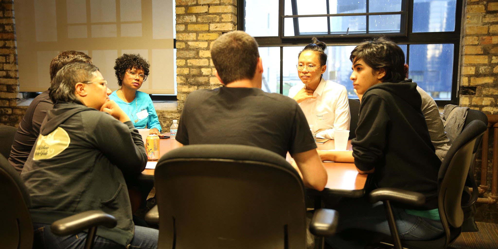

# 5. Values

[← Back to Contents](README.md)

### How do we describe what we do, and its value?

*The participants describe value from two points of view. First, the idea of value creation for different stakeholders. Second, the set of values embedded in the tools, which guide the development and growth of the tools and the communities around them. As one participant said: “The value that you create to the world really stems out of the values you use to run the project.” Different stakeholders—artists, teachers, students, contributors, and companies—value these tools in different ways. One challenge is articulating the intricate network of values to each stakeholder.*

**Key themes that emerged in discussion included:**

* [Education and Pedagogy](#education-and-pedagogy) (Creating Access to Art and Technology Fields)
* [Community](#community)
* [Creativity](#creativity)

## Education and Pedagogy 

### Creating Access to Art and Technology Fields

The initial stage at which most of the participants recognize the value of OSSTA is within education. These tools lower the entry barrier to coding. Several of the participants use these tools in a pedagogical context as teachers or students. While OSSTAs are commonly used in arts education, it should be noted they are also commonly used for teaching in the engineering and science fields, including mathematics, physics, and computer science. OSSTAs are used at all levels, from K12 to university, and for independent learning outside of institutions.

The use of the OSSTAs in teaching empowers students by demonstrating that they can learn by creating. OSSTAs are helpful in demystifying hardware, software, and technology. Students feel coding is accessible to those who are not computer scientists. One of the participants said: “Increasing inclusion is a really important aspect in what I do. Part of that is making machine learning usable by people who are not machine-learning researchers, who are not computer scientists, who may or may not be coders.” 

Working with OSSTAs also teaches communication as students work together, or share code with a broader community online. Creators learn not only how to code, but how to communicate around the sharing of that code, and the language of technology and programming. This is a skill that is becoming increasingly necessary as more fields come to rely on coding.

## Community

These tools build an online community that later becomes networks and relationships between people. Because of the transparency behind open source and how it celebrates community, OSSTAs have the characteristic of gathering people around them. These communities provide spaces for imagination, freedom, expression, and collaboration. 

Open-source software is inherently about knowledge sharing. The tools communicate key values of sharing knowledge by being inclusive, supportive, and approachable. Contributors find value in seeing others using their tools to create art. As one participant commented, “There is value that comes from being part of this community, as well as giving back to it.”

## Creativity

These tools provide the means for expression in a field that is at the forefront of technology. One of the participants said, “Artists need to have a seat at the table in defining technological futures. We need to be articulating what is ethical, what is interesting, what is beautiful, and what is important about technologies.” Another commented, “Artists are not just people that paint pictures and make sculptures, they are people who are actually showing everyone else how can they rearrange the world to make it closer to the vision that they imagine.” These tools enable creators to explore possibilities and be creative in a powerful way. As one participant put it, these tools “facilitate and give people the ability to say what they need to say through technology or media.”

OSSTAs also generate culture outside of corporations’ commercial interests. Creators are able to find an audience and build community around creative expression through code. Compared to using commercial tools, creators feel they are better able to maintain ownership and preserve their own cultural artifacts, rather than relying on particular proprietary platforms and file formats to access them.

---

[← Back to Contents](README.md)