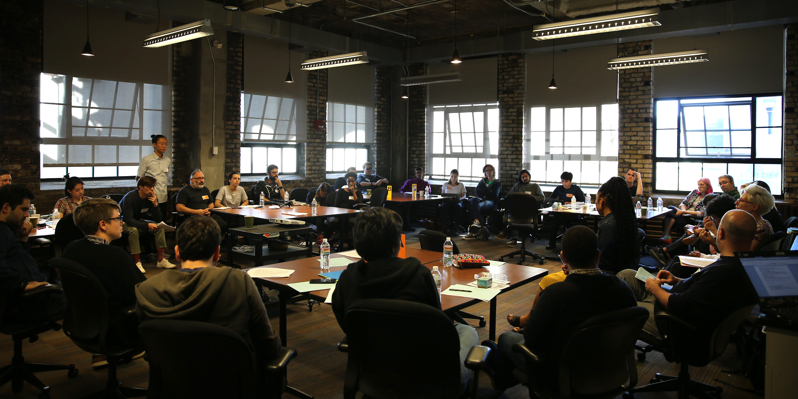

# 6. Futures

[← Back to Contents](README.md)

### What are the futures we want to see?

*The final full group conversation centered on the future of OSSTAs that participants would like to see. Sharon Lee De La Cruz opened the discussion with some questions and prompts:*

> *What is the future we want to see? 
> Take reality out of it as a limitation. 
> What do we need to do to get there? 
> What is the potential impact? 
> Think about aliens. 
> Think about how when we look at the stars we see the past. 
> Think about the feeling of the first time your code worked. 
> Think about yourself as larger than your physical self. 
> Think about someone that is not yourself. 
> Think about implicit bias. 
> Think about building community using justice. 
> Don’t be overwhelmed. 
> You are the future you’ve been waiting for.*

### Participants voiced these wishes for the future:

I want to see a future where open source is so attractive that it is the most obvious option.

I want work on open source to be recognized as a valuable use of our time.

I want to see a future that abolishes departments and universities and instead focuses on solving problems in which we are not so unique or strange to be hybrids.

Open source is acceptable in all societies.

I'd like to not hear about people being excluded so often and if I do, I’d like to feel we have more solutions.

I’m interested in a future where a lot of the things we laid out here in these creative-based open-source communities can cascade out to many different open-source cultures.

Exploring a new economy around open source so that contributors and creators don’t feel burned out, and can devote time to this.

Open-source principles honor diverse histories, Indigenous peoples, and non-numerical data.

I’d like to see a future where more computer languages aren’t in English.

Where we’re not looking at single GitHub repos as the entire project, but rather a distributed network of people that have taken projects, adapted them, made them their own, and made things that may not involve producing code in any way. And consider them all as owners and authors and contributors. 

When we talk to contributors we are not just implying those who write code, but also sharing ideas and moving the vision of the community forward.

I want to see a future where it’s easier to know our history. I see generations of work being lost because it no longer runs.

A way for different open-source communities and projects to come together in a way that can address some of the long-term problems through things like open standards.

Where the art we make is not subject to restrictions of technology like the Twitter API.

Where open source doesn’t imply uncompensated or unrecognized.

Where the distinction between user and contributor is not meaningful. I want to see this idea propagate to the world. That the users of technologies feel like they can also be contributors and makers.

Where there are lots of different tools and companies and open-source platforms that don't get monopolized by big players.

Where accessibility doesn’t have to be a conversation, it's just understood.

Where people look to open source as having answers. There’s a lot of embedded bias in science and I want open source to be a place where that’s dismantled.

Where we can continue to learn from each other and avoid making the same mistakes every time we start a new project.

Where people often make new open-source projects and when you ask them about it they say, “Well that was actually pretty straightforward and I knew what was going on.”

More tools and frameworks that help us build these tools. For people to feel there’s a lot of space in the world to make new tools.

Where as you’re building something there’s a tool that’s documenting what you’re doing and allows people to help you. A future where it’s easier to help.

Where more people are artists.

I want people to stop asking, “Is that art?”

I’d like to see our community better understand when to let things go, and how to pass the torch.

Where more funders in the arts and cultural sphere understand this community as well, and view it as an integral part of contemporary arts.

It’s equally acceptable to work for-profit and not-for-profit, and have time to do both.

Carlos Garcia: Where the culture around coding and other technical practices feels safer and acknowledges the biases that go into coding.

Where not everything comes from the same three schools.

Where the lines between artist, engineer, designer get so blurred that no one has to make the choice between what they want to be when they grow up.

Where we see a lot more people in this room who we don’t see right now because we’re not even aware of the tools they’re building, because their communities have never talked to ours.

Where universities teach you how to run communities.

Open data and training models being more accessible.

More affordable and accessible options for education outside of our corporate US education system.

Where the street is our canvas and you don’t need a commission to make public art.

In addition to more people making art, I just want to see more people making things.

The technologies that we’re developing are matched by society wisdom.

Where students aren’t afraid of the kinds of jobs they’ll be able to get when they graduate.

Where there are a huge number of people from very diverse backgrounds starting their own practices and finding a way to exist outside of getting acquired by one of five big companies. More funding and more of a pathway for small studios to exist.

Kids have more of a voice in what they learn.

Where there is a smaller learning curve. A future where open source upends the education system so college becomes unnecessary.

A future where we can overcome communication that makes us misunderstand each other.

A future where open source is fashionable.

Technology was less shaped by big companies.

More tools that are well-made that lower barriers of entry to accessing the newly possible.

Where it feels just as good to stop working on these projects as it does to start.

What other questions should we be asking?

What should be in a code of conduct?

What are the unintended effects of our projects, good and bad?

What might a replacement to GitHub look like that supports the kind of collaboration that we’d benefit from? What are the types of social structures we could use for healthy open-source projects?

A conversation about ethics in open source.
