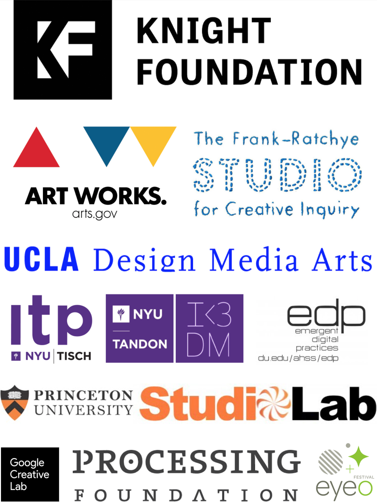

# Open Source Software Toolkits for the Arts (OSSTA): a Convening 

*Report [[**PDF**](pdf/ossta-report.pdf)] on a convening on Open-Source Software Toolkits for the Arts (OSSTA), Minneapolis, June 2–3, 2018. Organized by Golan Levin ([Frank-Ratchye STUDIO for Creative Inquiry](https://studioforcreativeinquiry.org/), Carnegie Mellon University) and Lauren Lee McCarthy ([p5.js](https://p5js.org/) & [UCLA Design Media Arts](http://dma.ucla.edu/)), with enabling support from [The John S. and James L. Knight Foundation](https://knightfoundation.org/).*

**Abstract:** This Report documents a convening on Open Source Software Toolkits for the Arts (OSSTA) held in June 2018. This event was a one-day conversation populated by founders, maintainers, and contributors of open-source arts-engineering toolkits. During this convening, participants discussed the challenges facing the development, maintenance, funding, sustainability, and community management of open-source arts toolkits, as well as their values and goals for the future. The goal of this Report is to help generate new opportunities for understanding, recognizing, and supporting work in this field. 

**Contact:** Questions about this document may be directed to: [studio-info@andrew.cmu.edu](mailto:studio-info@andrew.cmu.edu).

**Please cite this document as follows:** 
> Lauren Lee McCarthy, Thomas Hughes, and Golan Levin. "Open Source Software Toolkits for the Arts (OSSTA): a Convening". Report published by The Frank-Ratchye STUDIO for Creative Inquiry, Carnegie Mellon University, February 2021. [https://github.com/CreativeInquiry/OSSTA-Report](https://github.com/CreativeInquiry/OSSTA-Report).

This document is released under a [Creative Commons Attribution-ShareAlike 4.0 International license](https://creativecommons.org/licenses/by-sa/4.0/) (CC BY-SA 4.0).

# Front Matter

This Report is available in two formats: 

1. As a single [**downloadable PDF file**](pdf/ossta-report.pdf) (9.3 MB).
2. As a set of web pages in MarkDown format (available in this GitHub repository at [https://github.com/CreativeInquiry/OSSTA-Report](https://github.com/CreativeInquiry/OSSTA-Report))

## Table of Contents

* i. [**Preface**](#i-preface)
* ii. [**Overview**](#ii-overview)
* iii. [**Takeaways**](#iii-takeaways)
* iv. [**Participants**](#iv-participants)
* v. [**Field Definition**](#v-field-definition)
* vi. [**Credits**](#vi-credits)
* vii. [**Sponsors**](#vii-sponsors)

1. [**Challenges**](1_challenges.md)
   * [Maintenance](1_challenges.md#maintenance)
   * [Funding](1_challenges.md#funding)
   * [Communication](1_challenges.md#communication)
   * [Community and Interaction](1_challenges.md#community-and-interaction)
   * [Access, Diversity, and Inclusion](1_challenges.md#access-diversity-and-inclusion)
   * [Documentation](1_challenges.md#documentation)
   * [Leadership Transition](1_challenges.md#leadership-transition)
2. [**Development and Maintenance**](2_development_and_maintenance.md)
   * [Version Support](2_development_and_maintenance.md#version-support)
   * [Preservation](2_development_and_maintenance.md#preservation)
   * [Communication](2_development_and_maintenance.md#communication)
   * [Automation](2_development_and_maintenance.md#automation)
   * [Management](2_development_and_maintenance.md#management)
   * [Recognizing Individual Contribution](2_development_and_maintenance.md#recognizing-individual-contribution)
   * [Leadership Transition](2_development_and_maintenance.md#leadership-transition)
   * [Documentation and Education](2_development_and_maintenance.md#documentation-and-education) 
3. [**Community**](3_community.md)
   * [Representation](3_community.md#representation)
   * [Barriers](3_community.md#barriers)
   * [Opportunities](3_community.md#opportunities)
   * [Training and Mentorship for Users and Contributors](3_community.md#training-and-mentorship-for-users-and-contributors)
   * [Visibility](3_community.md#visibility)
   * [Promoting Interaction](3_community.md#promoting-interaction)
4. [**Funding and Sustainability**](4_funding_and_sustainability.md)
   * [Community Donations](4_funding_and_sustainability.md#community-donations)
   * [Grants](4_funding_and_sustainability.md#grants)
   * [Corporate Sponsorships and Partnerships](4_funding_and_sustainability.md#corporate-sponsorships-and-partnerships)
   * [Educational Institution Support](4_funding_and_sustainability.md#educational-institution-support)
   * [Establishing a Business Model](4_funding_and_sustainability.md#establishing-a-business-model)
   * [Infrastructure](4_funding_and_sustainability.md#infrastructure)
5. [**Values**](5_values.md)
   * [Education and Pedagogy](5_values.md#education-and-pedagogy)
   * [Community](5_values.md#community)
   * [Creativity](5_values.md#creativity)
6. [**Futures**](6_futures.md)
7. **Appendices**
   * [Appendix A: Participant Biographies](7a_appendix_biographies.md)
   * [Appendix B: Supporting Organizations](7b_appendix_supporters.md)
   * [Appendix C: Convening Information Packet](7c_appendix_packet.md)

## i. Preface

We are pleased to share this report documenting a convening on Open Source Software Toolkits for the Arts (OSSTA), organized by Golan Levin and Lauren Lee McCarthy in Minneapolis, Minnesota on June 2–3, 2018. This event was a one-day conversation and ‘unconference’, populated by founders, maintainers, and contributors of open-source arts-engineering tools such as [Processing](https://processing.org/), [p5.js](https://p5js.org/), [openFrameworks](https://openframeworks.cc/), [Cinder](https://libcinder.org/), [three.js](https://threejs.org/), and more. Grants officers from The Knight Foundation and the National Endowment for the Arts (NEA) also took part in the discussions, as well as a handful of volunteers and support staff. 

We hope that this report can function as an examination and a call to action, shining a light on the hard work and labor of contributing artists, designers, engineers, and community members. The organizers’ goal for this report is to generate new opportunities for understanding, recognizing, and supporting work in this field. 

At the same time, we recognize that there are many more toolkits, contributors, and perspectives than those represented by this one convening. We see this as a conversation that can hopefully spark others and contribute to an ongoing dialogue.

We offer our deepest gratitude to the participants of the convening, and the many, many other contributors to these toolkits, without whom, the field of art and technology would not exist. We would also like to thank Tom Hughes and the support staff from the [Frank-Ratchye STUDIO for Creative Inquiry](https://studioforcreativeinquiry.org/) at Carnegie Mellon University for making this event possible, and Taeyoon Choi who assisted in facilitation. Finally, we would like to thank the sponsors of this event, including The Knight Foundation; The National Endowment for the Arts; The Frank-Ratchye STUDIO for Creative Inquiry at Carnegie Mellon University; UCLA Department of Design | Media Arts; NYU Tandon School of Engineering, Integrated Digital Media; NYU Tisch School of the Arts, Interactive Telecommunications Program; Processing Foundation; University of Denver Emergent Digital Practices; Princeton University StudioLab; Google Creative Lab; and Eyeo Festival.

— *Golan Levin and Lauren Lee McCarthy (Co-Organizers)*

## ii. Overview

On June 2nd and 3rd, 2018, Golan Levin and Lauren Lee McCarthy, professors of media arts, with support from The John S. and James L. Knight Foundation, organized a convening on Open Source Software Toolkits for the Arts (OSSTA) in Minneapolis, Minnesota. This event was a one-day conversation and ‘unconference’, populated by founders, maintainers, and contributors of open-source arts-engineering tools such Processing, p5.js, openFrameworks, Cinder, three.js, and more. Grants officers from The Knight Foundation and the National Endowment for the Arts (NEA) also took part in the discussions, as well as a handful of volunteers and support staff. The convening took place on the weekend before the 2018 Eyeo Festival, an annual media arts conference in Minneapolis. 

The purpose of the convening, and this report, was to generate a first step towards defining the field of OSSTA initiatives, including an articulation of their impact as well as the challenges they face, for a wider audience. To this end, our gathering brought together leaders in the open-source arts community to have an in-depth conversation around the challenges and opportunities facing these platforms—specifically, regarding sustainability, funding, growth, management, diversity, and community building. The labor and impact of these tools, some of which are entering their third decade of existence, has remained under-recognized and under-resourced, putting the ecosystem of artists working with these tools at risk.

Because Open Source Software Toolkits for the Arts are primarily developed online by contributors distributed around the world, it’s rare to get so many project leaders and contributors in one room together. One primary goal of the convening was to foster inter-project dialogue and knowledge sharing that could benefit individual projects as well as the field as a whole.

The organizers’ goal for this report is to generate new opportunities for understanding, recognizing, and supporting work in this field. 

The Convening was organized around a set of six central questions or themes, which are discussed in the six web pages linked here:

1. [**Challenges**](1_challenges.md) — What are the biggest challenges in OSSTA?
2. [**Developer Operations**](2_development_and_maintenance.md) — How do we handle growth and management?
3. [**Community**](3_community.md) — How can we cultivate diverse and inclusive contributor communities?
4. [**Funding and Sustainability**](4_funding_and_sustainability.md) — How can we sustain this work?
5. [**Values**](5_values.md) — How do we describe what we do, and its value?
6. [**Futures**](6_futures.md) — What are the futures we want to see?

## iii. Takeaways

There were seven key takeaways from the OSSTA convening: 

#### 1. Maintenance is essential, wide-ranging, and often undervalued. 

Maintenance includes tasks such as updating a codebase to deal with updates to browsers, web specifications, operating systems, and hardware; publishing new releases; editing and improving documentation and examples; updating the project's website; guiding contributors; managing discussion on GitHub; and running social media accounts. Maintenance requires consistent effort and work which is often both undervalued by contributors (compared to adding new features) and not visible to users. For the long-term success of OSSTAs, maintenance and management structures, as well as the funding to support them, are needed. 

#### 2. Funding is necessary to create a sustainable and inclusive toolkit, and it is the biggest challenge for most OSSTAs.

OSSTAs often have a difficult time making their case to funding organizations because they fall into the in-between space of technology and art, and the value of creating a tool to help others make art is not recognized. Few funders possess the "dual expertise" necessary to understand and appreciate both creative art practices and open-source software development. One of the participants, who contributes to a toolkit widely used among generative artists, said: “We make things that help people make things that make things.” This concept is abstract and encompasses a broad spectrum of values both monetary and non-monetary. 

Most OSSTA projects are largely supported by volunteers, and such energy can dissipate over time. Additionally, relying solely on volunteer labor excludes those without the financial and/or class privilege to donate their time and knowledge. In addition to being open-source, most OSSTAs are also (purposefully) free, which further limits options for income. 

Funding sources range from community donations and grants, to educational institution support, corporate sponsorships, and licensing fees. However, none of the OSSTAs felt that they had achieved a sustainable business model. OSSTA leadership needs help identifying and cultivating funding sources, as well as developing infrastructure to manage resources.

#### 3. A focus on access, diversity, and inclusion is needed.

The field of OSSTA development is predominantly white and male, though this has been shifting in recent years, led by efforts from some projects that have explicitly centered values of diversity, inclusion, and access as core values for their community and tool. Community members recognize the need for contributors of more diverse backgrounds, identities, and skill sets. Given the centralized nature of the tools, creating pathways for newcomers to feel welcome and start to participate in the community is an ongoing challenge. Other common barriers include lack of resources (time to participate, access to equipment or high-speed internet), lack of accessibility (little or no consideration of disabled users, reliance on single modality documentation or outputs), limited documentation and/or English-only materials, and opaque leadership and community structures. Strategies for addressing these issues include establishing a clear code of conduct and set of community values, inviting new people into the project and creating leadership opportunities, being intentional with communication, using development and communication tools that require less technical expertise, and improving documentation.

#### 4. Documentation is critical but often lacking.

Documentation is critical for OSSTAs to support users and continue to grow. It is also recognized as one way of making projects more inclusive and lowering barriers to entry for new users. Additionally, improving documentation is often an entry point for new tool contributors. Documentation takes significant time to develop and maintain, and is often lacking, especially for intermediate users. Nearly all documentation is in English, and there’s a large need for translation of documentation materials.

#### 5. Community is just as important as code for many OSSTAs.

OSSTAs are known as much for the community that uses a given toolkit, as the toolkit itself. Many participants mentioned learning to use the tool because of the personal introduction they received into the community. There are many different types of people that interact with OSSTAs, including contributors, students, educators, and artists. Participants emphasized the need to give attention to areas other than code. Creating a tool involves the management of contributors, volunteers, and other members of the community. Not every creator of a tool is interested in the creation of a community and the management of it, but this community seems to develop naturally as the user base grows. There is a need for the creation of guidelines for interaction and a code of conduct that guides best practices for community members to interact with each other. As people approach these tools from different backgrounds, it is also necessary to create paths that welcome newcomers into the space so they feel welcomed and invited.

#### 6. Intentional communication needs to consider content, language, and tools used.

Communication is an area with many opportunities for improvement. Internal and external communications could be streamlined. Onboarding new members and making them feel welcome and respected is essential for the community. There is a need for an intentional and thoughtful approach to communication. This includes recognizing different communication styles, experience levels, native languages, and disabilities. The participants acknowledged that often they find themselves working against exclusionary communication patterns that are prevalent in open-source.

It is important to carefully consider the communication tools being used. One of the participants said, “How do you signal to people that they have a seat at the table, that the table is big, and that there are seats available? How do we get that message out there?” One of the most common communication channels used is GitHub, which offers distributed version control and source code management as well as collaborative communication tools. However, a significant amount of technical experience is required to use GitHub and this is a barrier for new people. Projects that centralize all communication on GitHub, even those related to non-coding aspects of the project, may severely limit participation and prevent growth. It is important to deploy approachable ways in which newcomers and people interested in contributing can be introduced to GitHub. Other channels used by the OSSTA community are email, social media, Slack, Discord,  Gitter, Discourse, Stack Overflow, online forums, and IRC channels. 

#### 7. Clarifying leadership structures could offer a pathway toward long-term sustainability.

OSSTAs have various leadership models. Many of the projects effectively use a “do-ocracy” model (where those that do the most work make decisions) or a “founder-leader” or “benevolent dictator” model (where the founder(s) of the project oversee decision making and community leadership). These leadership models often rely on implicit knowledge, and it is sometimes unclear how to make a decision or arrive at consensus when contributors are very distributed. The idea that anyone can theoretically participate in decision making does not always mean that it is accessible for everyone or that it is equal. Decision-making processes may be centralized in the leadership and with primary contributors, and it can be difficult to find a way in for those who are new to the project. Further, when volunteer-based projects function on a “do-ocracy” model, it privileges those who can afford to donate their time.

As decisions and responsibility continue to be centralized in a small group while the project scales, there is a point where the leaders and main contributors cannot keep up with the pace of requests. Leadership transition offers a way to lift the burden off project founders and also open more space for new and diverse voices. However, OSSTAs need to budget and plan the time, space, and resources necessary to develop opportunities for mentorship and transition. They must also address questions about how the new leader is chosen, and what their responsibilities are. One recent example of a leadership transition occurred with the p5.js project, which moved to an annually rotating leadership model in 2020.

## iv. Participants

Participants were selected for this convening based on a variety of factors including: historical relationships to the tools; unique, under-represented, and/or valuable perspectives and background experience; industry perspectives; pedagogic perspectives; and the constraints of the budget for transcontinental flights. This group was convened to develop and express deep and broad conversations around OSSTA, but in no way was meant to be exclusive of the thousands of other contributors, creators, and toolkits that actively contribute to and maintain these vibrant communities. 

This convening was designed to gather a representative sample of the voices, perspectives, and toolkits that comprised the landscape of open-source software tools for the arts in mid-2018. It is important to recognize the limitations of the two organizers and their ability to know all of the diverse contributors and toolkits out there. The number of participants was limited to 30 based on the resources available and the limits of facilitating and thoroughly documenting multiple conversations taking place within a single day. In this way, the viewpoints expressed here are a *snapshot*, rather than a *comprehensive survey*. We see this as one conversation that may hopefully spark others to expand on the perspectives and toolkits represented.

In this convening and report, we use the term “contributor” rather than “developer” to refer to people that work on OSSTAs, acknowledging the huge diversity of contributions including, but not limited to: documentation, teaching, graphic design, illustration, writing, organizing, curating, and software development.

Biographies for convening participants can be found in [Appendix A](7a_appendix_biographies.md). Affiliations listed below were current as of June 2018. 

#### Organizers
 
* [Golan Levin](http://www.flong.com/) (Frank-Ratchye STUDIO for Creative Inquiry at CMU)
* [Lauren Lee McCarthy](https://lauren-mccarthy.com/) (UCLA Design Media Arts; Processing Foundation)

#### Sponsors: 

* Chris Barr (The Knight Foundation)
* Jax Deluca (National Endowment for the Arts)
* Sarah Metz (National Endowment for the Arts)
	
#### Event Staff:

* Tom Hughes (Frank-Ratchye STUDIO for Creative Inquiry at CMU)
* Student assistants: Chloé Desaulles, Faith Kim, Tatyana Mustakos, Peter Sheehan
* Claire Hentschker (Frank-Ratchye STUDIO for Creative Inquiry at CMU)

#### Participants:

* [Aarón Montoya-Moraga](https://montoyamoraga.io/) (NYU ITP)
* [Adelle Lin](http://adelleninja.com/) (Code Liberation; Intel)
* [Andrés Colubri](https://andrescolubri.net/) (Processing; Broad Institute)
* [Andrew Bell](http://drawnline.net/) (Cinder)
* [Ari Melenciano](https://www.ariciano.com/) (NYU ITP)
* [Arturo Castro](https://arturocastro.net/) (openFrameworks)
* [Carlos 'L05' Garcia](https://creative-capital.org/artists/complex-movements/carlos-garcia/) (Complex Movements; UCLA)
* [Christopher Baker](https://www.saic.edu/profiles/faculty/christopher-baker) (School of the Art Institute of Chicago)
* [Chris Coleman](http://digitalcoleman.com/) (University of Denver EDP)
* [Dan Shiffman](https://shiffman.net/) (Processing Foundation; NYU ITP)
* [David Lublin](http://www.davidlubl.in/) (HAP Codec; Vidvox VDMX)
* [Dorothy R. Santos](https://dorothysantos.com/) (Processing Foundation; REFRESH)
* [Irene Alvarado](https://www.irenealvarado.com/) (Tensorflow.js; Google Creative Lab)
* [Kate Compton](http://www.galaxykate.com/) (Tracery)
* [Kate Hollenbach](http://www.katehollenbach.com/) (p5.js; independent artist)
* [Kyle McDonald](https://kylemcdonald.net/) (Independent artist) 
* [R. Luke DuBois](https://engineering.nyu.edu/faculty/r-luke-dubois) (NYU Integrated Digital Media)
* [Mathura Govindarajan](https://mathuramg.com/) (NYU ITP)
* [Omayeli Arenyeka](https://www.omayeli.com/) (Recurse Center)
* [Rebecca Fiebrink](https://www.doc.gold.ac.uk/~mas01rf/homepage/) (Wekinator; Goldsmiths College of London)
* [Ricardo Cabello](https://ricardocabello.com/) (Three.js)
* [Sharon De La Cruz](https://tisch.nyu.edu/about/directory/itp/1947935465) (Princeton StudioLab)
* [Sinan Ascioglu](https://www.wiredpieces.com/) (OpenProcessing)
* [Taeyoon Choi](http://taeyoonchoi.com/) (School for Poetic Computation; Processing Foundation)
* [Tega Brain](http://www.tegabrain.com/) (NYU Integrated Digital Media)
* [Theo Watson](https://theowatson.com/) (openFrameworks; DesignIO)
* [Zach Lieberman](http://zach.li/) (openFrameworks; School for Poetic Computation)

## v. Field Definition

More than ever, today's media artists create their work using a suite of free programming toolkits made for artists, by artists. These open-source software tools for the arts, or *OSSTAs* — such as Processing, p5.js, and openFrameworks—are created by small, self-organized collectives of artists, designers, and educators in order to fulfill needs that are unmet (and probably unmeetable) by the marketplace. Generally, these toolkits take the form of software libraries: bundles of code, associated documentation, and work examples that are free and accessible. Because they are made by artists for artists, they reflect and respond to the specific needs and vision of artists and designers. This ground-up approach allows for a community to unlock creative potential by defining its own tools, rather than be subject to the whims of major corporations.

Many of these toolkits, in addition to being open-source software (OSS), are also free/libre (altogether, FLOSS). There are many open-source software tools that cost money, and it’s notable that many of these can be downloaded without payment. It’s also one reason they are difficult to maintain. [This essay by Processing co-creator Casey Reas](https://medium.com/processing-foundation/processing-and-floss-d35aa4607f4c) may be a helpful resource for parsing the specific language of “free software” and “open-source software.”

Although these toolkits are developed and maintained by a relatively small number of people, they have become one of the primary means by which hundreds of thousands of artists, designers, and researchers all over the world create their work. Along the way, these toolkits have promoted software literacy within the arts, and arts literacy within technology—with the result that they are now one of the essential set of tools for making media art today. However, OSSTAs are not only used in the arts; they are also used by designers, educators, data visualization experts, scientists, and engineers. They are especially prevalent in education, providing the starting point for millions of students in arts, open-source, and technology fields. 

Despite their widespread use, however, the development of these important toolkits has remained a labor of love: they are often intermittently maintained by widely dispersed individuals, often without pay, in their spare time. This is difficult to sustain, and creates barriers to access for those without the means to volunteer their time. Suffering jointly from the underfunding that affects the arts *as well as* the underfunding that affects open-source software projects, the future of these initiatives is precarious. We seek to address this by creating contexts to strengthen these tools and to support the vibrant artist communities that have grown from them. Because these tools are created by few but used by many, we are confident that every “dollar in” is returned to the public many times over.

The first set of beneficiaries for this gathering are the 30 media artists invited to represent their toolkits. These individuals are true hybrids: artists who do their own, highly competent software engineering. Presently, they develop and improve these toolkits, both for themselves and for others, with little or no financial support. Our project benefits these individuals by providing direct support for this activity. By gathering them together for face-to-face collaboration, it also serves to strengthen their communities. The second set of beneficiaries are the (literally) thousands of artists, designers, musicians, students, and researchers who depend on these specific tools to create interactive installations, performances, visualizations, and online experiences. For these communities, the expected benefit is a set of tools to create their work that is more robust, more fully-featured, better-documented, and created by and representative of a wider diversity of perspectives.

## vi. Credits

The 2018 OSSTA Convening was a project of The Frank-Ratchye STUDIO for Creative Inquiry at Carnegie Mellon University. 

> <a href="http://studioforcreativeinquiry.org">The Frank-Ratchye STUDIO for Creative Inquiry</a> 
Carnegie Mellon University 
College of Fine Arts, Room #111 
5000 Forbes Avenue 
Pittsburgh, PA 15213 
[studio-info@andrew.cmu.edu](mailto:studio-info@andrew.cmu.edu)

#### Event Co-Organizers
* Golan Levin — Professor of Art, CMU School of Art; Director, CMU Frank-Ratchye STUDIO for Creative Inquiry
* Lauren Lee McCarthy — Associate Professor, UCLA Design Media Arts; p5.js Lead, The Processing Foundation

#### Report Authors
* Lauren Lee McCarthy — Associate Professor, UCLA Design Media Arts
* Tom Hughes — Associate Director, the Frank-Ratchye STUDIO for Creative Inquiry
* Golan Levin — Director, CMU Frank-Ratchye STUDIO for Creative Inquiry

#### Content Facilitators
* Taeyoon Choi
* Dorothy R. Santos
* Kate Hollenbach
* Carlos Garcia
* Sharon de la Cruz

#### Lead Organizational Partners
* Chris Barr — Director, Art and Technology, the Knight Foundation
* Jax Deluca — Director, Media Arts, National Endowment for the Arts

#### Program Management and Editorial Leads
* Tom Hughes — Associate Director, the Frank-Ratchye STUDIO for Creative Inquiry
* Shanae Phillips — STUDIO Program Assistant

#### Document Contributors, Editorial Assistance, and Documentation
* Chloé Desaulles
* Johanna Hedva
* Claire Hentschker
* Faith Kim
* Santiago Martinez
* Tatyana Mustakos
* Casey Reas
* Dorothy R. Santos
* Peter Sheehan
* Johanna St. John

#### Event Management and Production Coordination
* Tom Hughes
* Linda Hager
* Carol Hernandez
* Jenn Joy Wilson
* January Johnson 

## vii. Sponsors

The 2018 OSSTA Convening in Minneapolis was made possible by [The John S. and James L. Knight Foundation](https://knightfoundation.org/), and was realized with additional support from: [The National Endowment for the Arts](https://www.arts.gov/) • [The Frank-Ratchye STUDIO for Creative Inquiry at Carnegie Mellon University](https://studioforcreativeinquiry.org/) • [UCLA Department of Design Media Arts](http://dma.ucla.edu/) • [NYU Tandon School of Engineering, Integrated Digital Media](http://idm.engineering.nyu.edu/) • [NYU Tisch School of the Arts, Interactive Telecommunications Program](https://tisch.nyu.edu/itp) • [University of Denver Emergent Digital Practices](https://www.du.edu/ahss/edp/) • [Princeton University StudioLab](https://cst.princeton.edu/studiolab) • [Google Creative Lab](https://experiments.withgoogle.com/) • [Processing Foundation](https://processingfoundation.org/) • [Eyeo Festival](http://eyeofestival.com/).  

